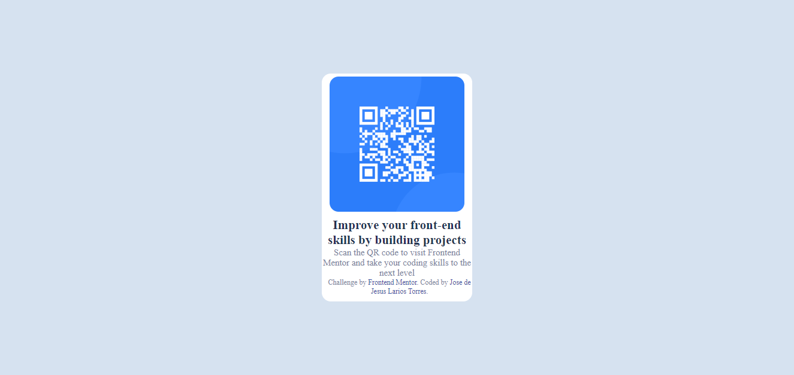

# Frontend Mentor - QR code component solution

This is a solution to the [QR code component challenge on Frontend Mentor](https://www.frontendmentor.io/challenges/qr-code-component-iux_sIO_H). Frontend Mentor challenges help you improve your coding skills by building realistic projects. 

## Table of contents

- [Overview](#overview)
  - [Screenshot](#screenshot)
  - [Links](#links)
- [My process](#my-process)
  - [Built with](#built-with)
- [Author](#author)

## Overview

### Screenshot

Design for the QR code component coding challenge

Design preview for the QR code component coding challenge - Desktop Overview

Design preview for the QR code component coding challenge - Mobile Overview

QR code component coding challenge - Overview

QR code component coding challenge - Samsung Galaxy A51/71 Overview

QR code component coding challenge - Iphone-6-7-8-plus.png Overview

### Links

- Solution URL: [Add solution URL here](https://github.com/LariosTorres/QR-Card.git)
- Live Site URL: [Add live site URL here](https://lariostorres.github.io/QR-Card/)

## My process

### Built with

- Semantic HTML5 markup
- CSS custom properties
- Flexbox

## Author

- Website - [Jose de Jesus Larios Torres](https://www.your-site.com)
- Frontend Mentor - [@LariosTorres](https://www.frontendmentor.io/profile/LariosTorres)
